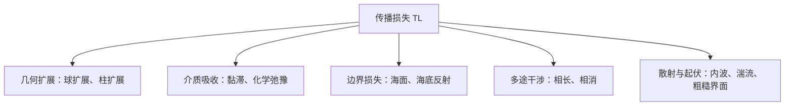
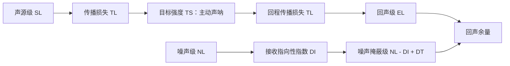
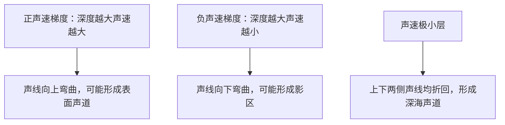
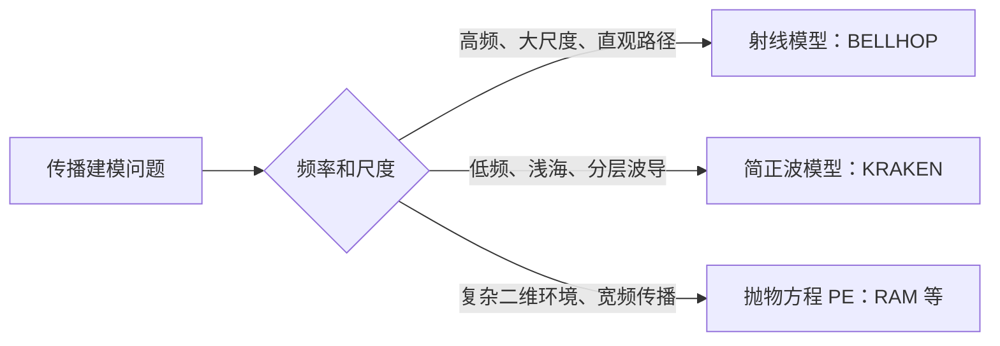
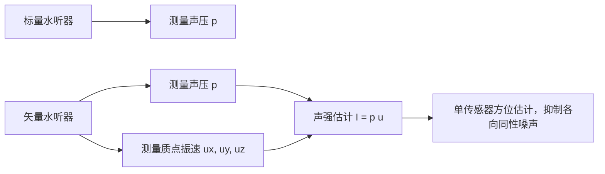
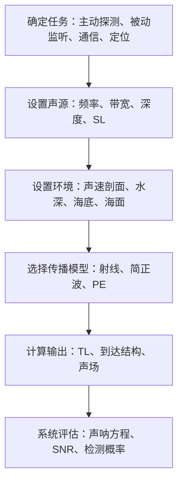

# 水声学原理：概念、参数与核心公式汇总

本文由本地资料《水声学原理》整理扩展而来，面向水声学入门、声呐方程推导、声传播模型选择和工程仿真复现。写法上尽量采用“定义 - 公式 - 物理意义 - 使用场景 - 易混点”的结构，便于后续继续补充源码、数据集和案例。

## 0. 总览：水声学在研究什么

水声学研究声波在海洋中的产生、传播、散射、接收和处理。它不是单纯的声学，也不是单纯的信号处理，而是由海洋环境、声传播物理、声呐系统和统计检测共同组成的工程学科。

常见学习模块包括：

- 基础声学量：声压、质点振速、声强、声阻抗、波数、分贝级。
- 声呐方程：主动声呐、被动声呐、噪声限制、混响限制、检测阈。
- 海洋介质：声速剖面、海面、海底、内波、湍流、深水散射层。
- 传播理论：射线、简正波、抛物方程。
- 典型声道：表面声道、深海声道、浅海波导、负跃层影区。
- 目标与干扰：目标强度、散射、混响、水下噪声、声传播起伏。

## 1. 基础声学量

### 1.1 声压

声压 `p` 是介质质点偏离平衡状态时产生的压强扰动。水声中常用参考声压为：

$$
p_\mathrm{ref}=1\,\mu Pa
$$

声压级：

$$
SPL = 20\log_{10}\frac{p_\mathrm{rms}}{p_\mathrm{ref}}\quad \mathrm{dB\ re\ 1\ \mu Pa}
$$

物理意义：

- 声压是水听器最直接测量的物理量。
- 海水中声波主要是纵向压缩波，海水不能支持稳定剪切波传播。
- 同一个 dB 数值必须说明参考量，否则没有物理意义。

易混点：

- 空气声学常用 `20 μPa` 作为参考声压，水声常用 `1 μPa`。
- 水声声压级与空气声声压级不能直接比较。

### 1.2 质点振速

质点振速 `u` 是介质微团在声波作用下的往复运动速度。

平面行波近似下：

$$
p = \rho c u
$$

其中 `ρ` 为海水密度，`c` 为声速。

物理意义：

- 远场平面波中声压与质点振速同相。
- 球面波近场中声压与质点振速可能存在明显相位差。
- 矢量水听器可以同时测声压和质点振速，从而获得方向信息。

### 1.3 声强

瞬时声强表示单位时间穿过单位面积的声能流密度：

$$
\mathbf{I}(t)=p(t)\mathbf{u}(t)
$$

对平面简谐波，平均声强可写为：

$$
I=\frac{p_\mathrm{rms}^{2}}{\rho c}
$$

单位为 `W/m^2`。

工程含义：

- 声强既有大小也有方向，是理解能量传播和声源定位的重要量。
- 阵列处理中，声强流向可用于辅助判断目标方位。

### 1.4 声阻抗率

平面波声阻抗率：

$$
Z=\frac{p}{u}=\rho c
$$

海水与海底沉积层之间的反射和透射，与两侧声阻抗差异密切相关。阻抗差越大，反射越强；阻抗越接近，透射越强。

### 1.5 频率、波长与波数

角频率、波长和波数的关系为：

$$
\omega = 2\pi f,\qquad \lambda=\frac{c}{f},\qquad k=\frac{2\pi}{\lambda}=\frac{\omega}{c}
$$

工程判断：

- 高频：波长短，方向性强，分辨率高，但吸收损失大。
- 低频：波长长，传播距离远，但阵列孔径需求大，分辨率较低。

## 2. 波动方程与边界条件

### 2.1 时域波动方程

在均匀无损介质中，声压满足：

$$
\nabla^2 p-\frac{1}{c^2}\frac{\partial^2 p}{\partial t^2}=0
$$

若考虑点声源，可在右端加入源项。

### 2.2 频域 Helmholtz 方程

令 `p(r,t)=Re{P(r)e^{-i\omega t}}`，得到频域方程：

$$
\nabla^2 P+k^2P=0
$$

当声速随空间变化时：

$$
\nabla^2 P+k^2(\mathbf{r})P=0,\qquad k(\mathbf{r})=\frac{\omega}{c(\mathbf{r})}
$$

### 2.3 三类常用边界条件

| 边界 | 数学形式 | 物理含义 | 典型场景 |
| --- | --- | --- | --- |
| 绝对软边界 | `p=0` | 声压释放，反相反射 | 理想平静海面近似 |
| 绝对硬边界 | `∂p/∂n=0` | 法向质点振速为零 | 理想刚性海底 |
| 阻抗边界 | `p/u_n=Z_b` | 声压与法向振速由底质阻抗约束 | 泥沙、岩石、分层海底 |

海面常被近似为软边界，但风浪、气泡层和粗糙度会使实际反射显著偏离理想情形。

## 3. 传播损失 TL

传播损失 `TL` 描述声波从声源到接收点过程中的声级衰减。常用定义：

$$
TL = 10\log_{10}\frac{I(1m)}{I(r)}
$$

若用声压表示：

$$
TL = 20\log_{10}\frac{p(1m)}{p(r)}
$$

### 3.1 几何扩展损失

球面扩展：

$$
TL_\mathrm{sph}=20\log_{10}r
$$

适用于深海自由场、距离尚未受到上下边界强约束时。

柱面扩展：

$$
TL_\mathrm{cyl}=10\log_{10}r
$$

适用于浅海波导或能量被海面和海底约束的远场近似。

实际经验模型常写成：

$$
TL = N\log_{10}r+\alpha r
$$

其中 `N` 介于 `10` 到 `20` 之间，`α` 为吸收系数。

### 3.2 海水吸收损失

吸收损失来自黏滞吸收和化学弛豫。主要机理包括：

- 硼酸弛豫：低频段明显。
- 硫酸镁弛豫：kHz 附近较重要。
- 纯水黏滞吸收：高频段逐渐主导。

经验上：

$$
TL_\mathrm{abs}=\alpha r
$$

其中 `α` 常用单位为 `dB/km`。频率越高，吸收通常越强；深度增大时，吸收系数可能下降。

### 3.3 传播损失的工程解释

传播损失不是单一物理过程，而是多个过程的综合：

在工程上，`TL` 往往是声呐性能预算中最敏感的量。主动声呐中 `TL` 以往返形式出现，误差会被放大。

## 4. 声呐方程

声呐方程是水声系统的“链路预算”。它把声源、传播、目标、噪声、阵列增益和检测门限放到同一个 dB 框架中。

### 4.1 主动声呐与被动声呐

| 类型 | 是否发射 | 接收对象 | 关键参数 | 主要干扰 |
| --- | --- | --- | --- | --- |
| 主动声呐 | 发射 | 目标回波 | `SL, TL, TS, NL, RL, DI, DT` | 噪声、混响、目标散射起伏 |
| 被动声呐 | 不发射 | 目标自身辐射噪声 | `SL_t, TL, NL, DI, DT` | 环境噪声、自噪声、目标辐射不稳定 |

### 4.2 核心参数

| 参数 | 名称 | 含义 |
| --- | --- | --- |
| `SL` | 声源级 | 距声源 1 m 处的等效声级，主动声呐发射强度 |
| `SL_t` | 目标辐射声源级 | 舰船、潜器等目标自身辐射噪声级 |
| `TL` | 传播损失 | 单程传播衰减，主动声呐通常出现两次 |
| `TS` | 目标强度 | 目标反向散射能力 |
| `NL` | 噪声级 | 海洋环境噪声、自噪声或平台噪声 |
| `RL` | 混响级 | 主动发射后由海面、海底、水体散射形成的干扰 |
| `DI` | 指向性指数 | 阵列抑制空间噪声的能力 |
| `DT` | 检测阈 | 检测器达到给定检测概率和虚警概率所需输入信噪比 |

### 4.3 主动声呐方程：噪声限制

回声级：

$$
EL = SL - 2TL + TS
$$

噪声掩蔽级：

$$
NML = NL - DI + DT
$$

回声余量：

$$
EE = EL - NML = SL - 2TL + TS - (NL-DI) - DT
$$

判据：

$$
EE \ge 0
$$

表示理论上达到检测条件。

### 4.4 主动声呐方程：混响限制

混响限制下，背景不是稳定噪声，而是主动发射引起的随机回波：

$$
EE_R = SL - 2TL + TS - RL - DT
$$

说明：

- 混响与发射信号相关，主动声呐中非常重要。
- 近距离、浅海、高频、粗糙海底或海面条件下，混响可能比环境噪声更限制探测。
- 严格工程模型中还会考虑波束、脉冲长度、散射面积/体积和处理增益。

### 4.5 被动声呐方程

被动声呐接收目标辐射噪声：

$$
SE = SL_t - TL - (NL-DI) - DT
$$

判据同样为：

$$
SE \ge 0
$$

被动声呐没有主动回波意义上的 `TS`，也没有由本机发射引起的混响项，但会受到目标辐射噪声变化、环境噪声和本舰自噪声影响。

### 4.6 主动声源功率限制

主动声呐不能无限提高 `SL`，常见限制包括：

- 空化：负压半周期产生气泡，吸收和散射声能，限制发射峰值。
- 阵元互作用：密排阵元相互辐射耦合，改变辐射阻抗。
- 材料极限：压电材料发热、机械开裂、电击穿或超过居里温度。

## 5. 海洋介质声学特性

### 5.1 海水声速

海水声速主要由温度、盐度和压力控制：

$$
c=c(T,S,z)
$$

常用经验认识：

- 温度升高，声速显著升高。
- 盐度升高，声速小幅升高。
- 深度增加，压力升高，声速缓慢升高。

一个常用近似公式为：

$$
c \approx 1449.2 + 4.6T -0.055T^2 +0.00029T^3 +(1.34-0.01T)(S-35)+0.016z
$$

其中 `T` 为摄氏温度，`S` 为盐度，`z` 为深度米。该式适合教学估算，精确计算应使用 TEOS-10、Chen-Millero 或 Del Grosso 等公式。

### 5.2 声速梯度与声线弯曲

声线总是向声速较低的一侧弯曲。

声速剖面是水声传播建模的第一输入。许多传播异常，例如影区、会聚区、深海声道和多途到达，都可以从声速剖面解释。

### 5.3 深海三层声速剖面

| 层次 | 主要特征 | 声学影响 |
| --- | --- | --- |
| 表面混合层 | 风浪搅拌，温度近似均匀 | 常形成表面声道 |
| 主跃层 | 温度快速下降，声速负梯度 | 声线向下弯曲，形成影区 |
| 深海等温层 | 温度低且变化小，压力主导 | 声速随深度增加，可能形成 SOFAR 声道 |

### 5.4 海面声学特性

平静海面可近似为压力释放面，反射系数接近 `-1`，反射波与入射波相位相反。

实际海面还要考虑：

- 粗糙度：海浪使镜面反射减弱，并产生海面混响。
- 气泡层：风浪产生气泡，带来强散射和吸收，高频影响尤其明显。
- 多途干涉：直达声与海面反射声叠加，造成传播损失随距离/频率振荡。

### 5.5 海底声学参数

海底不是简单硬边界。底质会决定反射、透射和底损。

| 参数 | 含义 | 影响 |
| --- | --- | --- |
| 密度 | 沉积物质量密度 | 影响阻抗与反射 |
| 纵波声速 | 海底压缩波速度 | 决定临界角与透射 |
| 横波声速 | 固体海底剪切波速度 | 影响弹性底反射 |
| 衰减系数 | 声能在底质中损耗 | 高频底损更明显 |
| 孔隙率 | 孔隙水占比 | 淤泥孔隙率高，声速通常较低 |

高声速海底可能存在临界掠射角，低声速软泥底通常没有明显全反射，声能更容易进入海底并损失。

### 5.6 海洋内部不均匀体

内波、湍流微结构和深水散射层会让声场从确定传播变成随机传播：

- 内波：大尺度声速扰动，远距离传播起伏的重要来源。
- 湍流微结构：小尺度温盐扰动，造成相位和幅度闪烁。
- 深水散射层：生物群昼夜迁移，气囊共振可形成体积混响。

## 6. 三大声传播模型

水声传播模型可按物理近似分为射线、简正波和抛物方程三类。

### 6.1 射线声学

射线声学是高频几何近似，假设波长远小于介质变化尺度。

Snell 定律常写为：

$$
\frac{\cos\theta}{c(z)}=\mathrm{constant}
$$

其中 `θ` 是声线与水平面的掠射角。不同教材也可能采用与垂直方向夹角的写法，形式会相应变为 `sinθ/c` 常数，关键是保持角度定义一致。

核心概念：

- 声线轨迹：在分层线性声速梯度中近似为圆弧。
- 反转点：声线弯曲到掠射角为零附近后折返。
- 本征声线：从声源到接收点的可达声线路径。
- 焦散区：多条声线汇聚，射线理论声强可能发散。
- 影区：射线不可达区域，真实波动场仍可能有衍射能量。

优点：

- 直观、速度快、适合高频远距离粗算。
- 可以直接给出到达结构、传播路径和多途时延。

局限：

- 低频失效。
- 对焦散区和影区处理不准确。
- 原始几何射线不能自然描述干涉和衍射。

### 6.2 简正波理论

简正波理论把海洋波导看作由海面和海底边界约束的分层系统。声场可分解为多阶模式叠加：

$$
P(r,z)=\sum_{m} A_m \phi_m(z) H_0^{(1)}(k_{rm}r)
$$

其中 `φ_m(z)` 是垂直本征函数，`k_rm` 是第 `m` 阶水平波数。

关键参数：

- 阶数：阶数越高，垂直方向振荡越多。
- 截止频率：低于截止频率时，该阶模式不能有效传播。
- 相速度：等相位面传播速度。
- 群速度：能量或脉冲包络传播速度。
- 频散：不同模式群速度不同，脉冲传播后会展宽。

适用场景：

- 浅海、低频、分层环境。
- 匹配场定位、地声反演、低频远程传播。

短板：

- 对水平变化环境处理困难。
- 深海高频时模式数巨大，计算量上升。

### 6.3 抛物方程 PE

抛物方程由 Helmholtz 方程在主传播方向上做单向近似得到，沿距离逐步推进声场。

核心思想：

- 主要考虑向前传播，忽略强反向传播。
- 可处理距离相关声速场、起伏海底和内波扰动。
- 自动包含一定的衍射和焦散区传播效果。

常见类型：

- 窄角 PE：适合小掠射角传播。
- 宽角 PE：可处理更大角度传播。
- 分步 Fourier PE：常用于距离步进数值计算。

局限：

- 对强后向散射和复杂三维问题有限。
- 结果依赖网格、步长、边界吸收层等数值设置。

### 6.4 三类模型对比

| 模型 | 理论基础 | 适用海域 | 优点 | 短板 |
| --- | --- | --- | --- | --- |
| 射线 | 高频几何声学 | 深海、高频、远距离 | 直观、快、路径清晰 | 焦散/影区失效，低频差 |
| 简正波 | 波导本征模态 | 规则浅海、低频 | 干涉精确，适合低频 | 水平变化难，模式多时慢 |
| PE | 单向波动数值近似 | 二维复杂海洋 | 可处理复杂环境和衍射 | 忽略强反向传播，无解析解 |

## 7. 典型声道传播

### 7.1 表面声道

表面混合层中若声速随深度增加而增加，小掠射角声线会向海面弯曲，并在表面层内被束缚传播。

特点：

- 常见于冬季或风浪强混合条件。
- 有临界掠射角，超过临界角的声线会穿出声道。
- 海面粗糙和气泡会增加损失。

### 7.2 深海声道 SOFAR

深海声道由声速极小层形成。声线在声道轴上下两侧都向声速较低方向折回，因此能量被长期束缚。

特点：

- 传播距离可达数千公里。
- 低频信号更容易远距离传播。
- 接收端可能出现会聚区和多途到达。

### 7.3 浅海均匀声道

浅海中海面和海底构成波导，声能受到上下边界约束，传播损失常近似从球扩展向柱扩展过渡。

特点：

- 海底反射损失非常关键。
- 简正波模型常比射线模型更适合低频问题。
- 多途和频散显著影响通信和定位。

### 7.4 负跃层影区

如果上层温暖、下层温度快速降低，声速随深度减小，声线向下弯曲，会在跃层下方或上方形成影区。

影区内不是完全没有声，而是几何射线难以到达；衍射、散射和简正波仍可能带来弱声场。

## 8. 目标反射与散射

### 8.1 目标强度 TS

目标强度定义为目标反向散射声强相对入射声强的 dB 表示：

$$
TS = 10\log_{10}\frac{I_s(1m)}{I_i}
$$

影响因素：

- 目标尺寸、形状和材料。
- 入射频率和波长。
- 目标姿态、方位和观测角。
- 弹性结构共振和局部亮点。

### 8.2 回声亮点

大型目标的回波常不是单一散射点，而由多个亮点组成，例如艇艏、围壳、螺旋桨和艇尾。

工程意义：

- 宽带主动声呐可在时域分辨多个亮点。
- 亮点结构可用于目标识别和姿态估计。
- 同一目标不同方位 TS 差异可能很大。

### 8.3 散射求解方法

常见方法包括：

- 分离变量法：适合球、圆柱等规则目标。
- Helmholtz 积分和边界元：适合复杂边界。
- 弹性波动模型：适合壳体、板结构和共振散射。
- 数值方法：FEM、BEM、FDTD 等。

## 9. 海洋混响

混响是主动声呐发射声波后，由海面、海底和水体散射体产生的大量随机回波。

### 9.1 三类混响

| 类型 | 来源 | 典型影响 |
| --- | --- | --- |
| 体积混响 | 气泡、浮游生物、深水散射层 | 中低频和生物丰富海区明显 |
| 海面混响 | 粗糙海面、风浪气泡 | 高频、近表面声呐明显 |
| 海底混响 | 泥沙、岩石、海底粗糙 | 浅海远距离主动声呐常见限制 |

### 9.2 混响与噪声的区别

| 项目 | 噪声 | 混响 |
| --- | --- | --- |
| 是否由本机发射引起 | 否 | 是 |
| 时间特性 | 可近似平稳 | 随发射后时间变化，非平稳 |
| 频谱关系 | 与发射信号无直接关系 | 与发射信号频带强相关 |
| 声呐类型 | 主动/被动都有 | 主要是主动声呐 |

## 10. 水下噪声

### 10.1 海洋环境噪声

环境噪声随频段有明显主导来源：

| 频段 | 主要来源 | 说明 |
| --- | --- | --- |
| 低频 `<100 Hz` | 远距离航运、地震、海洋动力过程 | 被动声呐低频背景重要来源 |
| 中频 `几百 Hz - 数 kHz` | 风浪、海面破碎、降雨 | 与海况和风速关系强 |
| 高频 | 热噪声、微小气泡、局地扰动 | 频率越高热噪声越明显 |

### 10.2 舰船辐射噪声

舰船辐射噪声通常由三部分组成：

- 机械噪声：主机、齿轮、泵、轴系振动，常出现低频线谱。
- 螺旋桨噪声：空化产生宽带连续谱，航速越高越强。
- 水动力噪声：流体冲刷壳体和附体产生的宽带噪声。

被动声呐识别常利用线谱、调制特征、宽带谱形和时频纹理。

### 10.3 自噪声

自噪声来自平台自身机械、水流和螺旋桨噪声，会限制本舰声呐性能。

降低自噪声的方法包括：

- 机械隔振。
- 降低航速。
- 优化导流罩。
- 阵列远离强振动源。
- 使用自适应噪声抵消。

## 11. 声传播起伏

声传播起伏指固定收发点之间的声强、相位和到达时间随时间随机变化。

主要成因：

- 温盐湍流微结构。
- 内波造成的大尺度声速扰动。
- 海面/海底粗糙随机散射。
- 目标姿态和平台运动。

影响：

- 主动声呐回波闪烁，检测概率下降。
- 被动定位、测速和匹配场处理精度下降。
- 水声通信多途和信道时变增强，误码率上升。

## 12. 矢量水听器

传统标量水听器只测声压，矢量水听器可同时测声压和质点振速。

优势：

- 单个传感器即可获得方向信息。
- 可缓解左右舷模糊。
- 在各向同性噪声场中，声强处理可提高信噪比。

局限：

- 传感器标定复杂。
- 姿态、安装和平台振动误差会影响方向估计。
- 低频和弱信号场景对噪声控制要求高。

## 13. 易混概念速查

### 13.1 行波与驻波

| 概念 | 特征 | 水声例子 |
| --- | --- | --- |
| 行波 | 能量沿传播方向输运 | 自由场球面波、简正波水平传播 |
| 驻波 | 正反波叠加，波节/波腹固定 | 简正波垂直方向结构 |

### 13.2 声源级、声压级与声强级

- 声压级是某一点测得的声压相对参考声压的 dB 值。
- 声源级通常指折算到距声源 1 m 处的等效发射声级。
- 声强级基于能量流密度，和声压级在平面波条件下可互相换算。

### 13.3 传播损失与吸收损失

- 传播损失是总衰减，包括扩展、吸收、边界、多途和散射。
- 吸收损失只是介质内部声能转化为热或化学弛豫损耗的一部分。

### 13.4 影区不是无声区

射线影区只表示几何射线无法到达。真实海洋中，衍射、散射、简正波和随机起伏仍可能带来可测声场。

### 13.5 混响不是环境噪声

混响是主动发射诱发的随机回波，随时间和距离变化；环境噪声通常与本机发射无关。

## 14. 工程建模建议

### 14.1 传播模型选择

| 问题 | 优先模型 | 说明 |
| --- | --- | --- |
| 高频主动声呐、路径和到达结构 | 射线 / BELLHOP | 快速直观，适合多途分析 |
| 浅海低频传播、匹配场定位 | 简正波 / KRAKEN | 波导干涉和频散描述更好 |
| 距离相关环境、内波、起伏海底 | PE / RAM | 能处理复杂二维环境 |
| 快速工程估算 | 经验 TL 模型 | 用于初步链路预算 |

### 14.2 做一次水声仿真的最小输入

最小参数清单：

- 频率或信号带宽。
- 声源深度和接收深度。
- 水深和距离范围。
- 声速剖面。
- 海底参数。
- 海面条件。
- 噪声级、目标强度或目标辐射声源级。

### 14.3 从学习到复现的推荐路径

1. 用经验公式手算 `TL` 和声呐方程，建立量级感。
2. 用 BELLHOP 跑射线轨迹、传播损失和到达结构。
3. 用 KRAKEN 或简正波工具理解浅海低频模式。
4. 用 PE 模型处理距离相关环境和复杂边界。
5. 用真实数据集做船噪分类、被动检测或通信信道估计。

## 15. 公式速查表

| 名称 | 公式 | 备注 |
| --- | --- | --- |
| 声压级 | `SPL = 20log10(p/p_ref)` | 水声 `p_ref=1 μPa` |
| 平面波声阻抗 | `Z=ρc` | 连接声压与振速 |
| 平均声强 | `I=p_rms^2/(ρc)` | 平面波近似 |
| 波数 | `k=2π/λ=ω/c` | 频域方程核心参数 |
| 球扩展损失 | `TL=20log10 r` | 自由场近似 |
| 柱扩展损失 | `TL=10log10 r` | 波导远场近似 |
| 主动回声级 | `EL=SL-2TL+TS` | 往返传播 |
| 主动噪声余量 | `EE=SL-2TL+TS-(NL-DI)-DT` | 大于 0 可检测 |
| 主动混响余量 | `EE_R=SL-2TL+TS-RL-DT` | 混响限制 |
| 被动余量 | `SE=SL_t-TL-(NL-DI)-DT` | 单程传播 |
| 声速估算 | `c≈1449.2+4.6T-0.055T²+0.00029T³+(1.34-0.01T)(S-35)+0.016z` | 教学近似 |

## 16. 后续可继续补充

- 用 BELLHOP 示例文件解释 `.env` 每一行含义。
- 用一组声速剖面画射线弯曲、影区和声道。
- 增加主动声呐、被动声呐、水声通信三类算例。
- 增加常见海底参数表和吸收系数计算表。
- 增加 ShipsEar / DeepShip 数据处理示例。
